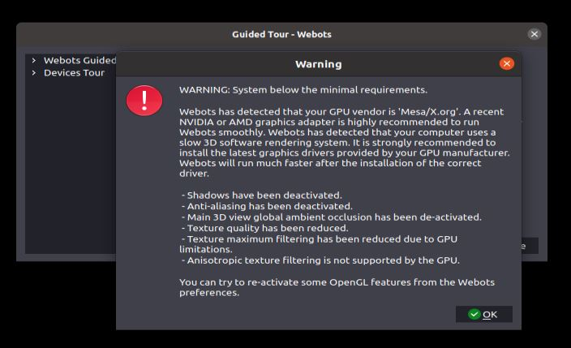
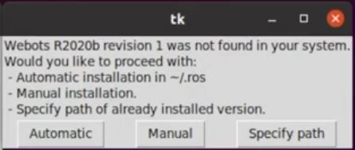

# install webots on Ubuntu 20.04.3 LTS Focal Fossa
# ATTENTION! due to excessive amount of steps of the procedures, I avoided to include some of them since some of them are already in the references/sources which are linked above each step. if you encounter any problem the sources might be of great help to you, thank you for your time.

the table of contents will be added soon.
## install with docker: [srouce](https://docs.docker.com/engine/install/ubuntu/)
### install docker:
### sudo apt-get update error with the 403 Forbidden with  https://download.docker.com/linux/ubuntu/dists/focal/InRelease
### failed trials:
- `sudo apt-get remove https://download.docker.com/linux/ubuntu/dists/focal/InRelease` was tried but was unsuccessful.
- `sudo rm –r /var/lib/apt/lists/*`  didn’t solve anything either.
- neither did `sudo apt-get clean && sudo apt-get update`

### Solution! 
#### initial [source](https://www.stevenchang.tw/blog/2019/08/21/Linux_apt-get-update-fail)
type `sudo apt-get update | grep “Failed” ` to find the Failed error.
then execute `grep –r –-include ‘*.list’ ‘^deb ’ /etc/apt/sources.list /etc/apt/sources.list.d` to see which file was corrupting `apt-get update`.
for final touch `sudo rm /etc/apt/sources.list.d/docker.list` to remove the corruption.

### 403 error again
the issue popped on again, recreated by these commands:
```
sudo apt-get update
sudo apt-get install apt-transport-https ca-certificates curl software-properties-common
curl -fsSL https://download.docker.com/linux/ubuntu/gpg | sudo apt-key add -
sudo apt-key fingerprint 0EBFCD88

sudo add-apt-repository "deb [arch=amd64] https://download.docker.com/linux/ubuntu zesty stable"

sudo apt-get update
sudo apt-get install docker-ce
```

`grep –r –-include ‘*.list’ ‘^deb ’ /etc/apt/sources.list /etc/apt/sources.list.d`
shows :
deb [arch=amd64] https://download.docker.com/linux/ubuntu zesty stable

### Failed trials
- `sudo add-apt-repository –-remove “deb [arch=amd64] https://download.docker.com/linux/ubuntu zesty stable”`

- `sudo apt-add-repository –-remove “deb [arch=amd64] https://download.docker.com/linux/ubuntu zesty stable”`

- `sudo apt-get purge “deb [arch=amd64] https://download.docker.com/linux/ubuntu zesty stable”`

### Solution:
`sudo nano /etc/apt/sources.list`
comment out “deb [arch=amd64] https://download.docker.com/linux/ubuntu zesty stable” with ‘#’ and then save and exit.

### conclusion for docker
after a lot of search it is concluded that docker does not support Iranian linux users due to sanctions. (or at least I think this is the case because of the 403 error)

## subtitute answer:
so as an alternative solution we moved to a virtual box in the windows and test the installation there.

### the virtual box ERROR:
VMSetError: Call to WHvSetupPartition failed: ERROR_SUCCESS (Last=0xc000000d/87)
### [solution](https://www.youtube.com/watch?v=hRl-0lcQjdU)
press windows key and search “turn windows features on or off”
disable: 
-	hyper V
enable:
-	virtual machine platform
-	windows hypervisor platform

wait for the windows to load necessary packages and then don’t restart the computer.
after it is done run as administrator the powershell and run the following command.
`bcdedit /set hypervisorlaunchtype off`
you can restart the computer now. and the VM should work fine.

### VM ubuntu error
could not get lock /var/lib/dpkg/lock’ Error in Ubuntu Linux, after `sudo apt update && sudo apt upgrade -y` command.
solution: just seperate the commands as
```
sudo apt update
sudo apt upgrade -y
```
and it will be fine.

update and upgrade linux. and update linux distribution.

you can use the software updater from the menu to upgrade your distribution version from 18.04 to 20.04.

### upgrade linux in VM needs more storage space

### for .vmdk format VM (Windows 10 Host)[solution](https://www.youtube.com/watch?v=Ujd72kRMfFM)
- run as admin VirtualBox
- run as admin CommandPrompt
- go to installation folder
- right click on the desired VM OS and select the settings,
- select storage,
- click on the storage,
- click on the .vmdk file under controller,
- right click on the location and copy it.
- if you run this command, `VBoxManage.exe modifyhd "location of the .vmdk file" --resize <new size in MB>` it says that it is not supported so you sould change the format to .vdi first.
- run this command to change the format: `VBoxManage.exe clonehd "src.vmdk" "clonehd.vdi" --format vdi`
- run the `VBoxManage.exe modifyhd "location of the .vdi file" --resize <size in MB>` command again, with the difference that the .vdi file is being resized.
- this command reverts it back to .vdmk format again, `VBoxManage.exe clonehd "location of .vdi" "newfinalfile.vmdk" --format vmdk` NOTE: that the newfinalfile.vmdk is different from src.vmdk file which was our original file.
- remove the original .vmdk file from the VM and add the new one instead. you can close the cmd if you want.
- go to the settings of the VM OS again and storage and right click on the .vmdk file and select remove attachment. then right click on the controller and select add existing hard drive, select +add and browse to your newfinalfile.vmdk.
- start the VM OS and resize the disk. follow the instructions in [this video](https://www.youtube.com/watch?v=jpMaTnnmcyI&t=65s)

### if fail partition:
### [solution](https://unix.stackexchange.com/questions/196512/how-to-extend-filesystem-partition-on-ubuntu-vm)
use gparted, install it by `sudo apt-get install gparted` then run gparted. you'll be good to go.

### install new ubuntu version (20.04)
you can use the software updater from the menu to upgrade your distribution version from 18.04 to 20.04.

### webots [installation procedure](https://cyberbotics.com/doc/guide/installation-procedure):
```bash
wget -qO- https://cyberbotics.com/Cyberbotics.asc | sudo apt-key add -
# make sure you are typing -O parameter in upper case, else you'll get an "gpg: no valid OpenPGP data found." error.

sudo apt-add-repository 'deb https://cyberbotics.com/debian/ binary-amd64/'
sudo apt-get update
# see alternative in the reference manual
sudo apt-get install webots

# installation successful
# run webots by the command below
webots
```

### warning about graphics drivers


[here](https://www.cyberciti.biz/faq/ubuntu-linux-install-nvidia-driver-latest-proprietary-driver/) is some useful information we can use.
### Find out information about your GPU
```bash
hwinfo --gfxcard --short
# OR
sudo lshw -C display
```

### command `hwinfo` not found
then you have to install it using
```bash
sudo apt install hwinfo -y
```

### install ROS2 ubuntu 20.04 focal fossa debian package method
follow the manual with copy pasting until ROS2 package is installed.
here are some commands which I used in the installation procedure.

```bash
locale  # check for UTF-8

sudo apt update && sudo apt install locales
sudo locale-gen en_US en_US.UTF-8
sudo update-locale LC_ALL=en_US.UTF-8 LANG=en_US.UTF-8
export LANG=en_US.UTF-8

locale  # verify settings
```

```bash
sudo apt update && sudo apt install curl gnupg2 lsb-release
sudo curl -sSL https://raw.githubusercontent.com/ros/rosdistro/master/ros.key  -o /usr/share/keyrings/ros-archive-keyring.gpg
```

```bash
echo "deb [arch=$(dpkg --print-architecture) signed-by=/usr/share/keyrings/ros-archive-keyring.gpg] http://packages.ros.org/ros2/ubuntu $(lsb_release -cs) main" | sudo tee /etc/apt/sources.list.d/ros2.list > /dev/null
```

```bash
sudo apt update

sudo apt install ros-foxy-desktop
```

#### setup environment variables.

```bash
printenv | grep -i ros
source /opt/ros/foxy/setup.bash
printenv | grep -i ros
```

save it into ~/.bashrc to have the environment variables in every new terminal.

```bash
echo "source /opt/ros/foxy/setup.bash" >> ~/.bashrc
```
use pip to install argcomplete.
```bash
# to install pip use this
sudo apt install -y python3-pip
# install argcomplete
pip3 install -U argcomplete
```


## webots ros2 package installation
**NOTE: you don't need to have webots installed to go through this manunal**

you can find this manual on the [source](https://www.youtube.com/watch?v=X_WHCjJNfbE&list=PLbEU0vp_OQkVM61fZuwC955N3sp91cv-a&index=2) video
first make sure you have ros2 installed, with `printenv | grep -i ros`
you can now install webots-ros2 package.
```bash
sudo apt install -y ros-foxy-webots-ros2
```
or if you have/want another ros distribution, you can do it by a similar command using the environment variable $ROS-DISTRO.

```bash
sudo apt install -y ros-$ROS-DSTRO-webots-ros2
```

run the following command,
```bash
ros2 launch webots_ros2_epuck robot_launch.py
``` 
for me it just worked fine. but you might get a prompt that says install webots, there are two cases that is possible, which you before this you have to check your webots version compatibility with ros2, the official websites always states this and you can check it up there if necessary.



1. you have webots installed and it supports ros2, so you should link the installation path to webots-ros2 package by clicking specify installation path. you can achieve this by this command:
```bash
printenv | grep -i webots
```

2. if you have webots installed but it doesn't support ros2 OR you don't have webots installed, select automatic, which will automatically install the compatible version of webots which supports ros2.


